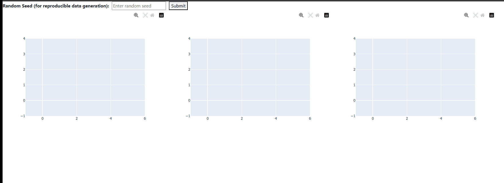

# A Quick Demonstration of WebApp

A simple GIF can communicate a lot.

You can try this [here](https://huggingface.co/spaces/hvinay/DecisionTreeVis). Code can be found [here](https://github.com/vinay-hebb/DecisionTreeVis)

## Contributions
1. To demonstrate how impurity reduces with depth
2. To visualize decision regions along the depth of the decision tree

Note that 
1. Below formulation is reproduced from [here](https://scikit-learn.org/stable/modules/tree.html#mathematical-formulation) for illustration and to show how impurity definintion is extended
2. I tried my best to keep the text minimal (wherever it is self-explanatory) so that the article is concise.
3. The definition of node impurity is expanded as mentioned in the [Node impurity vs Tree depth figure](#node-impurity-vs-tree-depth-figure) subsection.
4. I used mouse hover functionality for WebApp, hence it works best on PC

If you are well-versed with the mathematical formulation of decision trees, you can skip to the [WebApp](#webapp) section directly. 

# Decision Tree Classifier: Mathematical Formulation (scikit-learn)

A **Decision Tree Classifier** is a supervised learning algorithm that recursively partitions the feature space to classify data points. The scikit-learn implementation uses the **CART** (Classification and Regression Trees) algorithm, which builds binary trees using the feature and threshold that yield the largest information gain (or impurity reduction).

# Background

Given:
- $x_i \in \mathbb{R}^n,\quad i = 1, \ldots, l$
- $y \in \mathbb{R}$ (or for classification, $y \in \{0,\ldots, K-1\}$)
<!-- - $y \in \mathbb{R}^l$<ques>Is it l or scalar?</ques> -->

The goal is to find an estimator which estimates $y$ reliably for a new example $x$. One way to estimate a new example's label is by splitting the given region and labeling split regions as a particular label if we have sufficient confidence. Any new example is assigned that label if it falls in the split region. A computationally simple way to split into regions is to use thresholds on particular features. To gain confidence in regions, we can split them into many regions recursively. This can be represented as a tree with nodes. Each node has a split condition and a set of examples associated with it.

# Notations

- Consider a node $m$ and let the feature be $j$ on which we make a split.
- Let us denote $\theta=(j, t_m)$, where $t_m$ is the threshold which separates 2 regions.
- $Q_m$ is the data present at node $m$.
- $Q_m^{left}(\theta)$ and $Q_m^{right}(\theta)$ are the 2 regions split by node $m$. Mathematically, they can be written as below:

$$
\begin{aligned}
Q_m^{left}(\theta)  & = \{(x, y) \mid x_j \leq t_m\} \\
Q_m^{right}(\theta) & = Q_m \setminus Q_m^{left}(\theta)
\end{aligned}
$$

We have set up the regions, but we have not answered when we have sufficient "confidence" to assign a label to a region. We can use Gini impurity to measure it.

# Gini Impurity

Let us assume $y$ takes values $0,\ldots, K-1$ (i.e., $K$ classes for classification). For a node $m$ and class $k$, we can write probabilities $p_{mk}$(to measure proportion of each class) as:
$$p_{mk} = \frac{1}{n_m} \sum_{y \in Q_m} I(y = k)$$
where
- $n_m$ is the number of samples at node $m$
- $I(\cdot)$ is the indicator function

To denote impurity considering all classes at node $m$, we can write:
$$H(Q_m) = \sum_{k=1}^{K} \hat{p}_{mk}(1 - \hat{p}_{mk})$$

> Impurity denotes uncertainty about the node. If only one class is present($H(Q_m)=0$) in the node, then node is *pure* and there is no uncertainty
<!-- > Let us write some mathematical notations to denote how we split into regions. When do we say we have sufficient "confidence"? One way to mesure is to use Gini impurity. -->

# Quality of Split

We have not explained how to grow the tree using the above impurity function. To grow a tree, we need to make split by choosing a particular feature and threshold. We can write what the impurity will be after choosing $\theta=(j, t_m)$, which shows the quality of the split:

$$G(Q_m, \theta) = \frac{n_m^{left}}{n_m} H(Q_m^{left}(\theta)) + \frac{n_m^{right}}{n_m} H(Q_m^{right}(\theta))$$

Where:
- $n_m^{left}$ is the number of samples on the left child node
- $n_m^{right}$ is the number of samples on the right child node
- $n_m$ is the number of samples at node $m$
- $H(\cdot)$ is the impurity function (e.g., Gini impurity)

$G(Q_m, \theta)$ can also be thought of as the weighted average impurity after the split.

To get the best $\theta^*$, we can choose as below:

$$\theta^* = \underset{\theta}{\arg \min}\, G(Q_m, \theta)$$

<!-- <ques>Is it impurity reduction or impurity?</ques> <imp>It does not matter since impurity of node $m$ does not change with $\theta$</imp> -->

Note that:
1. We optimize over $\theta=(j, t_m)$, i.e., over both features $j$ and thresholds $t_m$.
2. The above optimization considers impurity and quality of split based on node $m$ and its child nodes rather than the entire tree (greedy optimization).

Recurse for subsets $Q_m^{left}$ and $Q_m^{right}$ until the maximum allowable depth is reached, $n_m < \text{min}_{\text{samples}}$, or $n_m = 1$.

# Training Algorithm

1. At each node $m$:
    - For every feature $j$ and possible threshold $t$:
        - Compute the impurity of the split $G(Q_m, \theta)$, where $\theta = (j, t)$.
    - Select the split $`\theta^* = (j^*, t^*)`$ that minimizes $G(Q_m, \theta)$.
    - Split the data into $Q_m^{left}$ and $Q_m^{right}$ using $\theta^*$.
2. Recursively repeat step 1 for the left and right child nodes.
3. Stop splitting when a stopping criterion is met (e.g., maximum depth, minimum samples per node, or node is pure).

# Inference Algorithm

Given a trained decision tree and a new input sample $x$:

1. Start at the root node.
2. At each internal node:
    - Evaluate the split condition (e.g., "Is feature $j$ less than threshold $t$?").
    - If the condition is true, move to the left child node; otherwise, move to the right child node.
3. Repeat step 2 until a leaf node $l$ is reached.
4. At the leaf node $l$:
   - For classification, the predicted class is:
     $$\hat{y} = \underset{k \in \{0, \ldots, K-1\}}{\operatorname{argmax}} \; p_{lk}$$
     where $p_{lk}$ is the proportion of class $k$ samples in leaf $l$ (or probabilities as defined earlier).

<!-- <note>**Summary:**</note>
Traverse the tree according to the split conditions until a leaf is reached, then output the majority class (classification) or mean value (regression) of that leaf.
 -->

# WebApp

## How WebApp Works

1. A user inputs a random seed and submits. This generates data $(X, y)$.
2. A decision tree classifier (single tree) is trained on the generated data.
3. The trained decision tree is visualized (called the Decision Tree Structure figure).
4. Node impurity (or weighted average impurity) for each depth is visualized (called the Node impurity vs Tree depth figure).
5. When the user hovers on the impurity vs depth plot, a truncated decision tree (tree truncated up to hovered depth) is created using the trained decision tree.
6. Using the truncated tree, data is reclassified and visualized (called the Decision regions of subtree figure) to provide insights about how decision regions and split conditions are formed.

### Note
1. When user hovers on node $m$ with depth $d$, decision boundaries are visualized for depth=$d$ rather than node $m$(i.e., all nodes with depth=$d$ are considered leaf nodes)
2. Sometimes it can so happen that decision boundary regions dont change with depth, this is possible as tree may predict the same label after the split
3. Node impurity vs Tree depth figure has reversed $x$ and $y$ axis(to align tree depth and yaxis)
4. Leaf nodes don't have split conditions.
5. Maximum depth is the total number of levels in the tree. For the root node, Depth = $0$.

## Decision Tree Structure figure
1. When you hover on any node $m$, it shows 2 sets of information is visible. 
    1. **split condition**: shows condition used to split the data at node $m$ further e.g.: `X0 <= 0.7` 
        1. This could just also display `Leaf` if one hovers on leaf node as it will not have any split condition
    2. **samples and prediction**: For the data at node $m$, how many samples belong to each class in their ground truths and what will be the prediciton at that node e.g.: `samples == [3, 8], predict=1`. For all `11 samples`, node $m$ predicts them as class `1`
2. Entire tree structure obtained is visualized for the given data
3. Note that effect of split condition is not associated with prediction in that node
4. When a new example arrives if condition is true then new example is sent to left child node

## Decision regions of subtree figure
1. This shows decision regions considering a given truncated tree
2. Decision regions are shown with lighter color of corresponding samples

## Node impurity vs Tree depth figure

1. Hovering on the impurity vs depth plot at depth $d$ should update the Decision regions of subtree figure to show the regions defined by the tree truncated at depth $d$.
2. If one hovers on a depth $d$, then the following are to be considered:
    1. The decision boundary should reflect all splits from the root to depth $d$.
    2. Classification corresponding to that depth is visualized without considering **split conditions of nodes at that depth** (these conditions are used to grow the tree further).
    3. In other words, if one hovers on $\text{depth}=d$, then regions belonging to $Q_m^{left}$ and $Q_m^{right}$ (nodes having depth $d$) are not visualized, but all regions belonging to node $m$ having depth less than $d$ are.
3. Node impurity is computed similar to the quality of split defined in the [Quality of split](#quality-of-split) section, except that all nodes, predictions, and their corresponding data are considered at that depth.

## Instance 1

- We can see how the decision tree classifies "easier" samples on the left first correctly and goes deeper to classify "harder" examples on the right.

## Instance 2

- Impurity need not reach $0$ at leaf nodes based on various hyperparameters (in this case, `max_depth=7`) and data.

## Observations

1. We can see that node impurity decreases with depth.
2. The root node classifies the entire data into a single class (majority class), which is expected.
3. One can see that the algorithm is trying to reduce impurity as much as possible based on the decisions made at each node.
4. Impurity need not reach $0$ at leaf nodes.

# References

- [scikit-learn Decision Tree Documentation](https://scikit-learn.org/stable/modules/tree.html#mathematical-formulation)